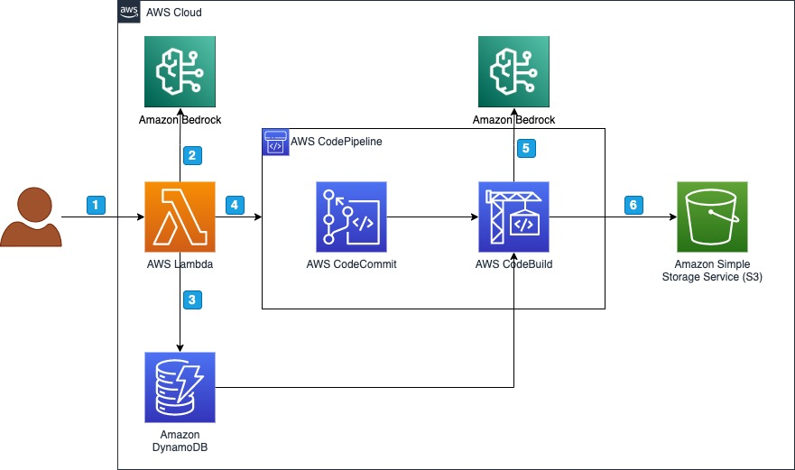

# Generative AI Synthetic Data Generator



## Table of Contents

- [Installation](#installation)
- [Contributing](#contributing)
- [License](#license)

## Installation

**Supported Python Versions**

This [AWS CDK](https://aws.amazon.com/cdk/) stack was developed using `Python 3.10`

[Download](https://www.python.org/downloads/) it here and install it.

Once you cloned the repository create a virtual environment using

```
python3 -m venv .venv
```

Activate the environment:

```
source .venv/bin/activate
```

*Optional: Windows users*

```
.venv\Scripts\activate.bat
```

Next install the required libraries using:

```
pip install -r requirements.txt
```

Finally, initialize pre-commit using

```
pre-commit install
```

At this point you can now synthesize the CloudFormation template for this code.

```
cdk synth
```

And of course deploy the stack:

```
cdk deploy --all --require-approval never
```

The `-—all` flag ensures that all components are installed at once. By specifying `-—require-approval` never you won’t need to approve each component to be deployed.


## Contributing
If you wish to contribute to the project, please see the [Contribution Guidelines](./CONTRIBUTING.md).

## License

This repository is licensed under the MIT-0 License. It is copyright 2023 Amazon.com, Inc. or its affiliates. All Rights Reserved. The license is available at: http://aws.amazon.com/mit-0
